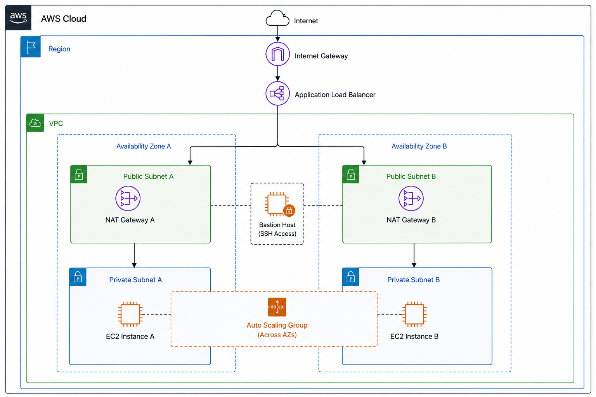
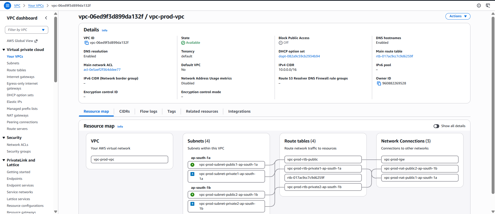
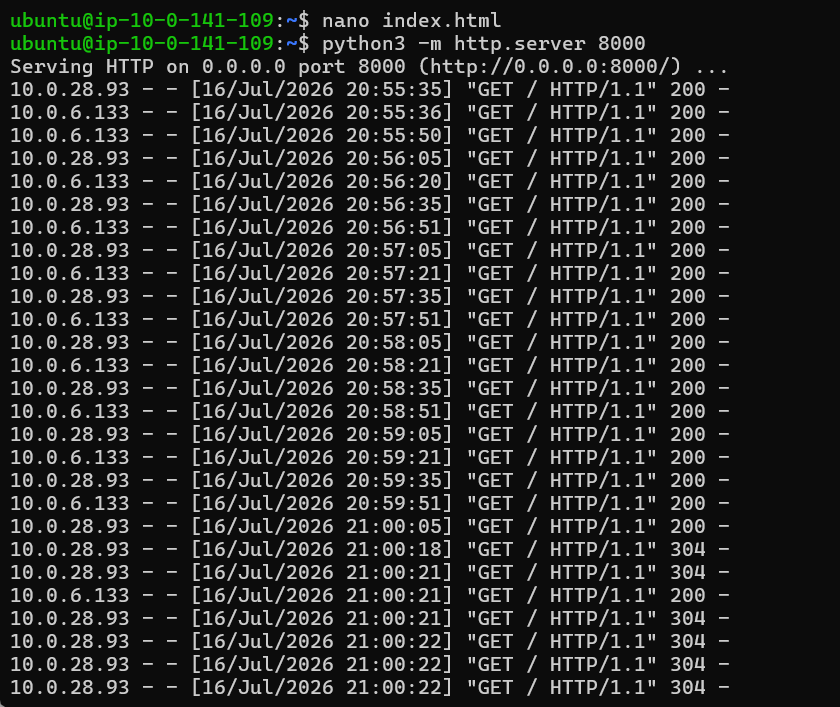
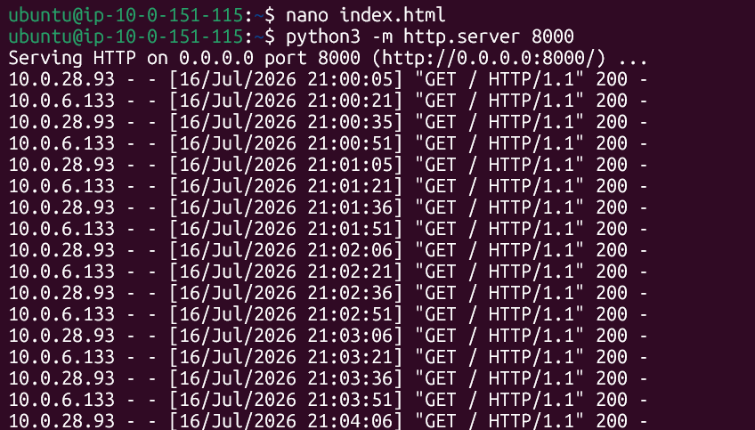
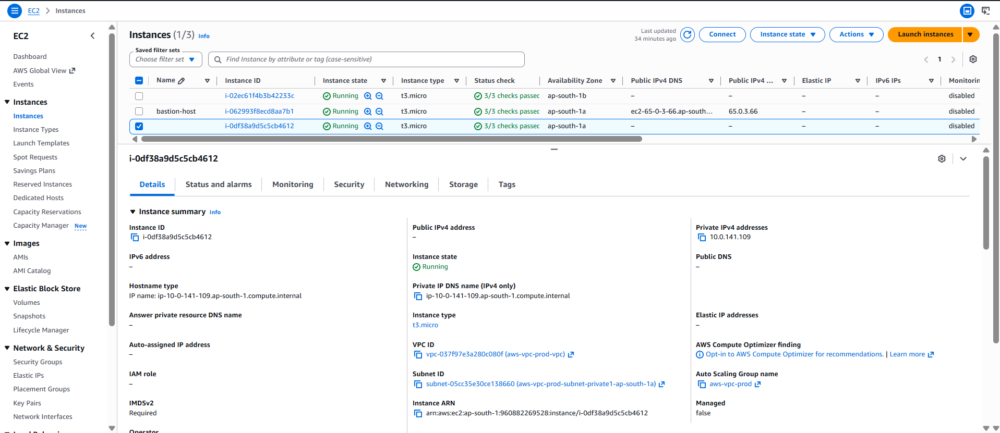
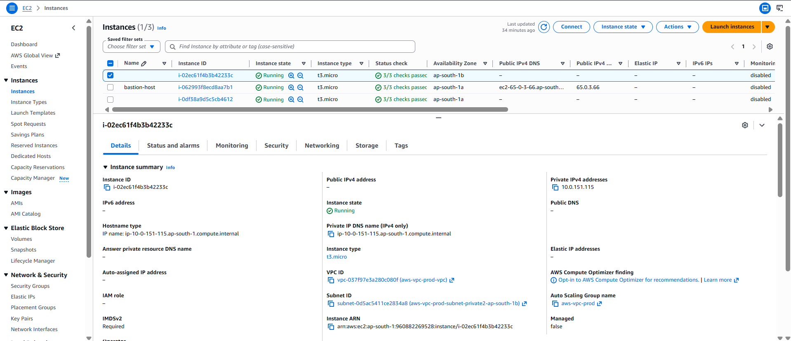
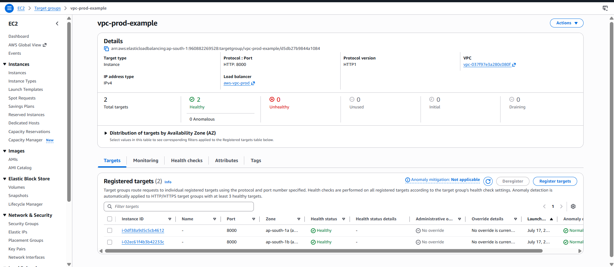
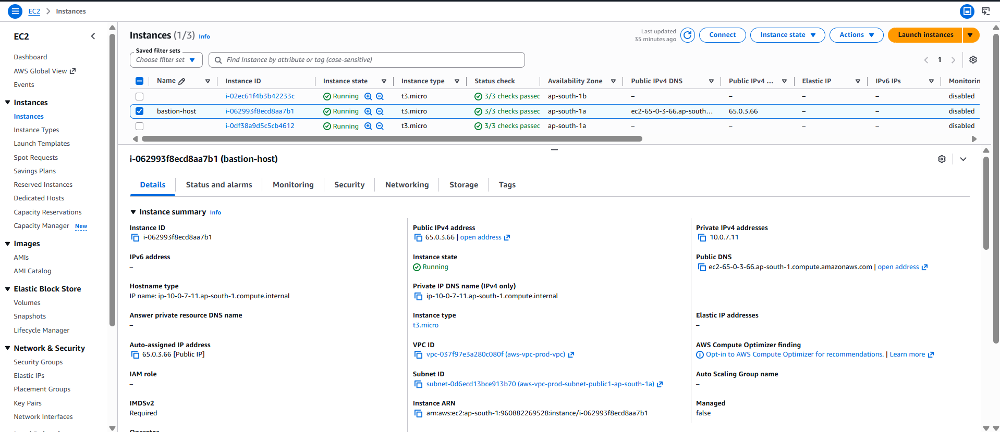
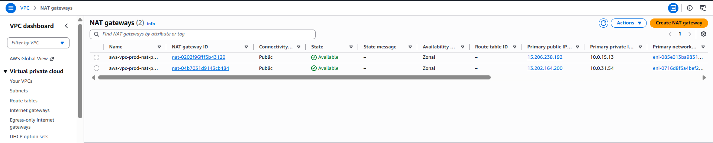
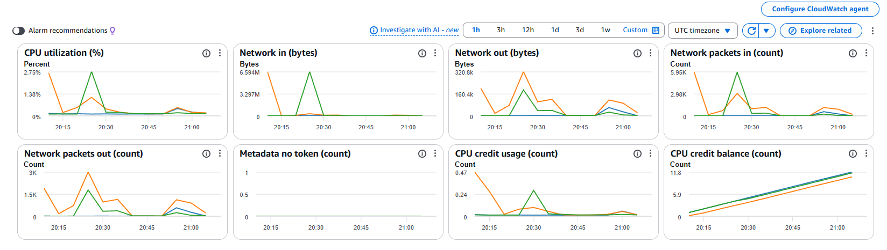

# AWS Production VPC Architecture with Public & Private Subnets



## Project Overview

This project demonstrates a production-style AWS VPC architecture following AWS networking best practices.

The infrastructure is designed with **high availability, scalability, and security** using multiple Availability Zones, public and private subnet separation, an Application Load Balancer, Auto Scaling Group, and secure administrative access through a Bastion Host.

Application traffic enters through the Application Load Balancer and is distributed to EC2 instances running inside private subnets. The private instances do not have direct internet exposure and use NAT Gateways for outbound internet connectivity.


# Features

- Custom Amazon VPC with public and private subnet architecture
- Multi-AZ deployment for high availability
- Application Load Balancer for traffic distribution
- Auto Scaling Group for managing EC2 instances
- EC2 instances deployed inside private subnets
- NAT Gateways for private subnet internet access
- Bastion Host for secure SSH administration
- Security Groups for network access control
- CloudWatch monitoring for infrastructure health


# Architecture Overview

The architecture contains:

- Custom VPC
- Two Availability Zones
- Public subnets
- Private subnets
- Internet Gateway
- NAT Gateways
- Application Load Balancer
- Target Groups
- Auto Scaling Group
- EC2 instances in private subnets
- Bastion Host

## How to Recreate

Follow these steps to deploy this infrastructure in your own AWS account.

### Prerequisites
*   **AWS Account** with administrative permissions.
*   **EC2 Key Pair** created in your target region (e.g., `ap-south-1`).
*   **AWS CLI** configured (optional, for faster execution).

### Deployment Steps

1.  **Create VPC & Subnets**
    *   Create a new **VPC** (e.g., `10.0.0.0/16`).
    *   Create **2 Public Subnets** and **2 Private Subnets** across two different Availability Zones (e.g., `ap-south-1a`, `ap-south-1b`).

2.  **Configure Internet Access**
    *   Create an **Internet Gateway (IGW)** and attach it to the VPC.
    *   Create a **NAT Gateway** in each Public Subnet (requires an Elastic IP).

3.  **Setup Route Tables**
    *   **Public Route Table**: Associate with Public Subnets; add route `0.0.0.0/0` → **Internet Gateway**.
    *   **Private Route Table**: Associate with Private Subnets; add route `0.0.0.0/0` → **NAT Gateway**.

4.  **Launch Bastion Host**
    *   Launch an **EC2 instance** (t2.micro) in a **Public Subnet**.
    *   Assign a Public IP and attach a Security Group allowing **SSH (22)** from your IP address.

5.  **Configure Security Groups**
    *   **ALB Security Group**: Allow **HTTP (80)** from `0.0.0.0/0`.
    *   **Private EC2 Security Group**:
        *   Allow **SSH (22)** *only* from the **Bastion Security Group ID**.
        *   Allow **Custom TCP (e.g., 8000)** *only* from the **ALB Security Group ID**.

6.  **Deploy Application & Load Balancer**
    *   Create a **Launch Template** for EC2 with your Flask app user-data script.
    *   Create an **Application Load Balancer (ALB)** in the Public Subnets.
    *   Create a **Target Group** and register the private EC2 instances.
    *   Configure an **Auto Scaling Group** using the Launch Template and Target Group.

7.  **Enable Monitoring**
    *   Enable **CloudWatch Detailed Monitoring** on the Auto Scaling Group.
    *   Create a **CloudWatch Alarm** to trigger if CPU > 70%.

### ✅ Validation
*   Access the **ALB DNS URL** in a browser; the app should load.
*   SSH into the **Bastion Host**, then SSH into a **Private Instance** using its private IP.
*   Terminate a private EC2 instance manually; verify the **Auto Scaling Group** launches a replacement within 2–3 minutes.
*   Check **CloudWatch** to ensure metrics are flowing from private instances.

> ⚠️ **Cost Warning**: NAT Gateways and ALBs incur hourly charges. **Delete all resources** immediately after testing to avoid unexpected costs.


## Request Flow

```

                 ┌───────────┐
                 │ Internet  │
                 └─────┬─────┘
                       │
                       ▼
               ┌────────────────┐
               │    Internet    │
               │    Gateway     │
               └───────┬────────┘
                       │
                       ▼
            ┌──────────────────────┐
            │   Application Load   │
            │       Balancer       │
            └──────────┬───────────┘
                       │
                       ▼
                ┌────────────────┐
                │  Target Group  │
                └──────┬─────────┘
                       │
                       ▼
           ┌─────────────────────────┐
           │     EC2 Instances       │
           │   (Private Subnets)     │
           └──────────┬──────────────┘
                       │
                       ▼
                ┌─────────────┐
                │ NAT Gateway │
                └──────┬──────┘
                       │
                       ▼
                  ┌──────────┐
                  │ Internet │
                  └──────────┘

```

## Secure Administration Flow

```

Administrator
      |
      |
      v
Bastion Host (Public Subnet)
      |
      |
      v
Private EC2 Instances

```


# AWS Services Used

| AWS Service | Purpose |
|---|---|
| Amazon VPC | Creates isolated network infrastructure |
| Amazon EC2 | Hosts application servers |
| Application Load Balancer | Distributes incoming traffic |
| Auto Scaling Group | Maintains EC2 availability |
| Target Groups | Routes traffic to EC2 instances |
| NAT Gateway | Provides outbound internet access |
| Internet Gateway | Enables public internet connectivity |
| Bastion Host | Secure access to private resources |
| Security Groups | Controls network traffic |
| CloudWatch | Monitors AWS resources |


# VPC Architecture

The VPC is designed using AWS production architecture practices.

The VPC includes:

- Public subnets
- Private subnets
- Route tables
- Internet Gateway
- NAT Gateways
- Network Interfaces


## VPC




# Multi Availability Zone Deployment

To improve fault tolerance, resources are deployed across two Availability Zones.

Each Availability Zone contains:

- Public subnet
- Private subnet
- NAT Gateway

This design reduces the impact of a single Availability Zone failure.

# Public Subnets

Public subnets contain internet-facing resources:

- Application Load Balancer
- Bastion Host
- NAT Gateway

These resources communicate with the internet through the Internet Gateway.


# Private Subnets

EC2 application servers are deployed inside private subnets for security.

Benefits:

- No direct internet exposure
- Controlled access through Load Balancer
- Secure application hosting
- Outbound internet access through NAT Gateway


## EC2 Server Deployed in Private Subnet


# Deployment Verification

The application server is successfully deployed inside a private subnet.

Although the EC2 instance does not have direct public access, it can serve application traffic through the Application Load Balancer.

The following screenshot shows the server running successfully inside the private VPC environment.





# EC2 Instances

Multiple EC2 instances are deployed across private subnets in different Availability Zones.

The instances:

- Receive requests from the Load Balancer
- Are managed by Auto Scaling Group
- Remain protected from direct public access






# Application Load Balancer

The Application Load Balancer distributes incoming requests across healthy EC2 instances.

Features:

- Traffic distribution
- Health checks
- High availability
- Fault tolerance


## Load Balancer


*Note: One of the targets is intentionally shown as unhealthy because no application was deployed on that EC2 instance. This demonstrates the Application Load Balancer's health check behavior, where unhealthy targets are automatically excluded from request routing until they become healthy.*

# Target Groups

Target Groups are used by the Application Load Balancer to manage backend EC2 instances.

Features:

- Registers EC2 instances
- Performs health checks
- Routes traffic only to healthy targets


> [!NOTE]
> One target is intentionally marked as **unhealthy** because the application was not deployed on that EC2 instance. This demonstrates how the Application Load Balancer detects unhealthy targets and routes traffic only to healthy instances.




# Auto Scaling Group

The Auto Scaling Group automatically manages EC2 instance capacity.

Benefits:

- Maintains desired instance count
- Replaces unhealthy instances automatically
- Supports scaling requirements
- Improves application availability


# Bastion Host

A Bastion Host provides secure administrative access to private EC2 instances.

Purpose:

- Secure SSH access
- Prevent direct public access to private servers
- Improve security posture





# NAT Gateway

NAT Gateways allow EC2 instances in private subnets to access the internet.

Used for:

- Installing updates
- Downloading packages
- Connecting to external services

For high availability, NAT Gateways are deployed in both Availability Zones.




# Monitoring

Amazon CloudWatch is used to monitor EC2 instance health and performance.

Monitoring includes:

- CPU utilization
- Instance status
- Resource usage metrics



> 
**Note:** The following CloudWatch dashboard displays monitoring metrics for all three EC2 instances deployed in the Auto Scaling environment.


# Security Implementation

Security practices implemented:

- EC2 instances deployed inside private subnets
- Load Balancer used as the public entry point
- Bastion Host used for administration
- Security Groups controlling traffic
- NAT Gateway providing outbound internet access
- Multi-AZ deployment for reliability


# Challenges Faced

## Private Subnet Access

### Challenge

EC2 instances deployed in private subnets cannot be accessed directly from the internet.

### Solution

A Bastion Host was deployed in a public subnet to securely access private EC2 instances through SSH.


## Private Instance Internet Access

### Challenge

Private EC2 instances required internet access for updates and package installation while remaining protected from public access.

### Solution

NAT Gateways were deployed in each Availability Zone to provide outbound internet connectivity.


## High Availability

### Challenge

Application availability should not depend on a single Availability Zone.

### Solution

Resources were distributed across multiple Availability Zones using an Application Load Balancer and Auto Scaling Group.


# Key Learnings

Through this project, I learned:

- Designing production-level AWS VPC architecture
- Creating public and private subnet environments
- Deploying resources across multiple Availability Zones
- Configuring Application Load Balancers
- Managing EC2 instances with Auto Scaling Groups
- Implementing Bastion Host architecture
- Configuring NAT Gateway connectivity
- Monitoring AWS infrastructure


# Future Improvements

Possible improvements:

- Configure Route 53 for DNS management
- Add HTTPS using AWS Certificate Manager
- Implement AWS WAF for security
- Automate infrastructure using Terraform
- Add CI/CD pipeline
- Add Amazon RDS database layer


# Conclusion

This project demonstrates a production-style AWS networking architecture that incorporates high availability, secure network segmentation, and scalable application deployment.

Key concepts demonstrated include:

- Amazon VPC networking
- Public and private subnet design
- Multi-AZ deployment
- Application Load Balancer
- Auto Scaling Group
- Bastion Host administration
- NAT Gateway connectivity
- CloudWatch monitoring
- AWS security best practices