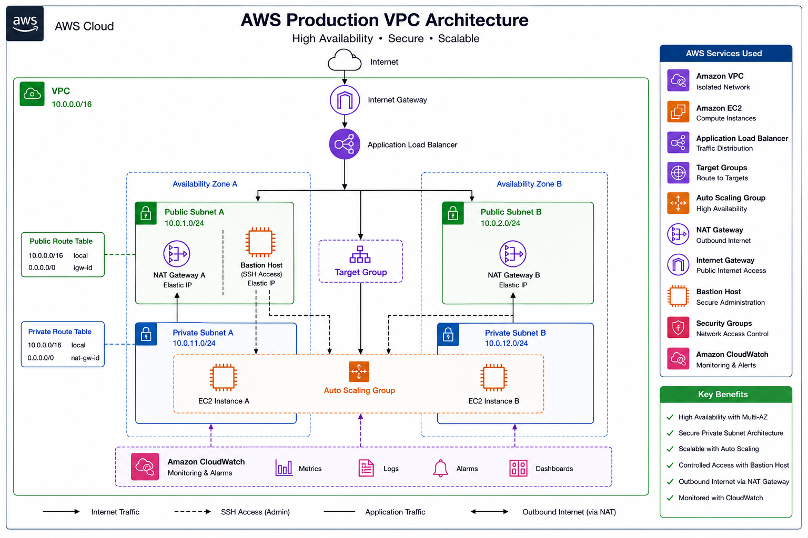
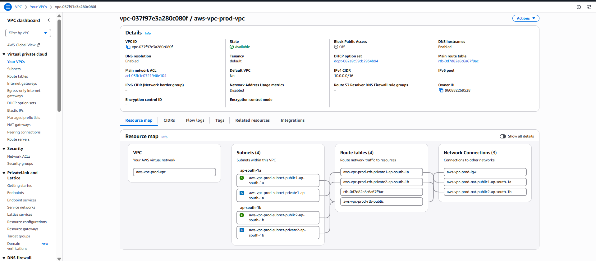

# AWS Secure VPC Infrastructure using Terraform



## Project Overview

This project was initially built manually using the AWS Management Console to understand how individual AWS networking services work together. The same infrastructure was then recreated using Terraform to demonstrate Infrastructure as Code (IaC) practices and automation.

The architecture follows a production-style design where application traffic enters through an Application Load Balancer, is distributed across EC2 instances running in private subnets, and administrative SSH access is provided through a Bastion Host.

---

## Key Features

- Production-style VPC architecture with public and private subnet separation
- Multi-AZ deployment for high availability
- Application Load Balancer for traffic distribution
- Auto Scaling Group with rolling instance refresh
- Bastion Host for secure SSH administration
- IAM least-privilege roles for EC2 instances
- IMDSv2 enforced and EBS encryption enabled on all instances
- CloudWatch monitoring with custom metrics via CloudWatch Agent
- Infrastructure fully automated with Terraform

---

## Architecture Overview

### Request Flow

```
              ┌────────────┐
              │  Internet  │
              └─────┬──────┘
                    │
                    ▼
            ┌────────────────┐
            │Internet Gateway│
            └───────┬────────┘
                    │
                    ▼
         ┌──────────────────────┐
         │ Application Load     │
         │ Balancer (public)    │
         └──────────┬───────────┘
                    │
                    ▼
             ┌─────────────┐
             │ Target Group│
             └──────┬──────┘
                    │
          ┌─────────┴──────────┐
          ▼                    ▼
   ┌─────────────┐     ┌─────────────┐
   │ EC2 (AZ-A)  │     │ EC2 (AZ-B)  │
   │ Private Sub │     │ Private Sub │
   └──────┬──────┘     └───────┬─────┘
          │                    │
          ▼                    ▼
   ┌─────────────┐     ┌─────────────┐
   │ NAT GW (A)  │     │ NAT GW (B)  │
   └──────┬──────┘     └───────┬─────┘
          └─────────┬──────────┘
                    ▼
              ┌───────────┐
              │ Internet  │
              └───────────┘
```

### SSH Administration

```
Engineer → Bastion Host (public subnet) → Private EC2 instances
```

### Network Layout

| Resource | CIDR | AZ |
|---|---|---|
| VPC | `10.0.0.0/16` | — |
| Public Subnet A | `10.0.1.0/24` | ap-south-1a |
| Public Subnet B | `10.0.2.0/24` | ap-south-1b |
| Private Subnet A | `10.0.11.0/24` | ap-south-1a |
| Private Subnet B | `10.0.12.0/24` | ap-south-1b |

---

## AWS Services Used

| Service | Purpose |
|---|---|
| Amazon VPC | Isolated network with public and private subnets |
| Internet Gateway | Inbound internet access for public subnets |
| NAT Gateway | Outbound internet access for private subnets |
| Application Load Balancer | Distributes HTTP traffic across EC2 instances |
| Target Group | Health checks and traffic routing to EC2 |
| Auto Scaling Group | Maintains desired EC2 count, replaces unhealthy instances |
| Launch Template | EC2 configuration template used by the ASG |
| EC2 | Application servers in private subnets + Bastion Host |
| Security Groups | Firewall rules controlling traffic between components |
| IAM | Least-privilege role for EC2 (SSM + CloudWatch Agent) |
| CloudWatch | CPU alarm and log collection via CloudWatch Agent |

---

## Architecture Images

### VPC



### Flask App deployed on EC2 Instances in Private Subnets


### Application Load Balancer


### Target Groups


### Auto Scaling Group


### Bastion Host


### NAT Gateway


### CloudWatch Monitoring


---

## Security Design

| Control | Implementation |
|---|---|
| **Private subnets** | Application EC2 instances have no public IP |
| **ALB as entry point** | Only the ALB is publicly accessible |
| **Bastion Host** | Only path for SSH into private instances |
| **Security Group references** | Private EC2 SG allows SSH only from Bastion SG, app traffic only from ALB SG |
| **IMDSv2 required** | All instances enforce token-based metadata access (prevents SSRF attacks) |
| **EBS encryption** | All volumes encrypted at rest |
| **Least-privilege IAM** | EC2 role has only `AmazonSSMManagedInstanceCore` and `CloudWatchAgentServerPolicy` |
| **No secrets in code** | No credentials, account IDs, or private keys in Terraform files |

### Security Group Rules

| Security Group | Inbound | Source |
|---|---|---|
| ALB SG | HTTP (80) | `0.0.0.0/0` |
| Bastion SG | SSH (22) | `var.allowed_ssh_cidr` |
| Private EC2 SG | SSH (22) | Bastion SG (reference) |
| Private EC2 SG | App (8000) | ALB SG (reference) |

---

## Terraform Implementation

The infrastructure is organized into separate Terraform configuration files grouped by responsibility (networking, security, IAM, load balancing, compute, and monitoring). Since this project provisions a single environment, the configuration is intentionally kept as flat files instead of reusable modules to make the codebase straightforward and easy to follow.

### Terraform Folder Structure

```
terraform/
├── main.tf               # Terraform config, AWS provider, AMI data source
├── variables.tf          # Input variables
├── outputs.tf            # Outputs (ALB DNS name, Bastion IP, etc.)
├── terraform.tfvars.example
│
├── networking.tf         # VPC, subnets, IGW, NAT gateways, route tables
├── security.tf           # Security groups and rules
├── iam.tf                # IAM role and instance profile
├── bastion.tf            # Bastion Host EC2 instance
├── alb.tf                # Application Load Balancer, target group, listener
├── autoscaling.tf        # Launch template and Auto Scaling Group
├── monitoring.tf         # CloudWatch CPU alarm
│
├── scripts/
│   └── user_data.sh      # EC2 bootstrap: Flask app + CloudWatch Agent
│
└── .gitignore
```

---

## Deployment Instructions

### Prerequisites

| Tool | Version |
|---|---|
| [Terraform](https://developer.hashicorp.com/terraform/install) | `>= 1.15` |
| [AWS CLI](https://docs.aws.amazon.com/cli/latest/userguide/) | v2 |
| AWS account | With permissions to create VPC, EC2, ELB, IAM resources |

### 1. Configure AWS credentials

```bash
aws configure
```

### 2. Clone and configure

```bash
git clone https://github.com/deepanshu-talan/aws-secure-vpc-infrastructure.git
cd aws-secure-vpc-infrastructure/terraform

cp terraform.tfvars.example terraform.tfvars
```

Edit `terraform.tfvars`:

```hcl
project_name     = "aws-vpc-project"
aws_region       = "ap-south-1"
key_pair_name    = "aws_login"          # Name of your existing AWS Key Pair
allowed_ssh_cidr = ["203.0.113.10/32"]  # Your IP address
```

### 3. Deploy

```bash
terraform init
terraform plan
terraform apply
```

### 4. Access the application

```bash
terraform output alb_dns_name
```

Open the URL in a browser — the Flask app will respond.

### 5. SSH access

```bash
# SSH into the Bastion Host
ssh -i /path/to/aws_login.pem ubuntu@$(terraform output -raw bastion_public_ip)

# From the Bastion, SSH into a private instance
ssh -i /path/to/aws_login.pem ubuntu@<private-instance-ip>
```

---

## SSH Key Handling

Terraform does not generate or manage the SSH key. An existing AWS Key Pair is referenced by name via `var.key_pair_name`.

The corresponding private key (`aws_login.pem`) must already exist locally. It is stored on your machine and **must never be committed to Git**. The `.gitignore` excludes `*.pem` and `*.key` files.

---

## Challenges Faced

Building this project involved several real-world AWS decisions:

- **Subnet routing** — understanding that private subnets need explicit route tables pointing to NAT Gateways, while public subnets route to the Internet Gateway.
- **Security Group references** — using SG-to-SG references instead of CIDR ranges for inter-component rules, which is more secure and does not require hardcoding IP addresses.
- **Health check configuration** — the ALB health check path must return HTTP 200. The Flask app exposes a `/health` endpoint specifically for this.
- **IMDSv2 enforcement** — the Launch Template and Bastion instance both require `http_tokens = "required"` to prevent SSRF-based metadata theft.
- **NAT Gateway dependency** — EIPs and NAT Gateways must be created after the Internet Gateway is attached to the VPC (`depends_on`).

---

## Validation

```bash
cd terraform/
terraform fmt
terraform init -backend=false
terraform validate
```

GitHub Actions runs these same checks automatically on every push and PR to `main`.

---

## Cost Considerations

NAT Gateways are the primary cost driver in this architecture. The default configuration deploys one per AZ for high availability.

- **NAT Gateways** — charged hourly per gateway + per GB processed. Default is one per AZ.
- **Application Load Balancer** — charged hourly + per LCU.
- **EC2 instances** — 2× `t3.micro` by default (Free Tier eligible).

To reduce cost during testing:

```hcl
single_nat_gateway = true  # Use one shared NAT Gateway instead of two
```

> ⚠️ Destroy all resources after testing to avoid ongoing charges:
> ```bash
> terraform destroy
> ```

---

## Future Improvements

- Replace Bastion SSH with AWS Systems Manager Session Manager
- Add HTTPS using AWS Certificate Manager
- Configure Route 53 for DNS management
- Add AWS WAF in front of the ALB
- Enable VPC Flow Logs and ALB access logs
- Configure S3 + DynamoDB remote Terraform state
- Add an RDS database layer in a dedicated DB subnet
